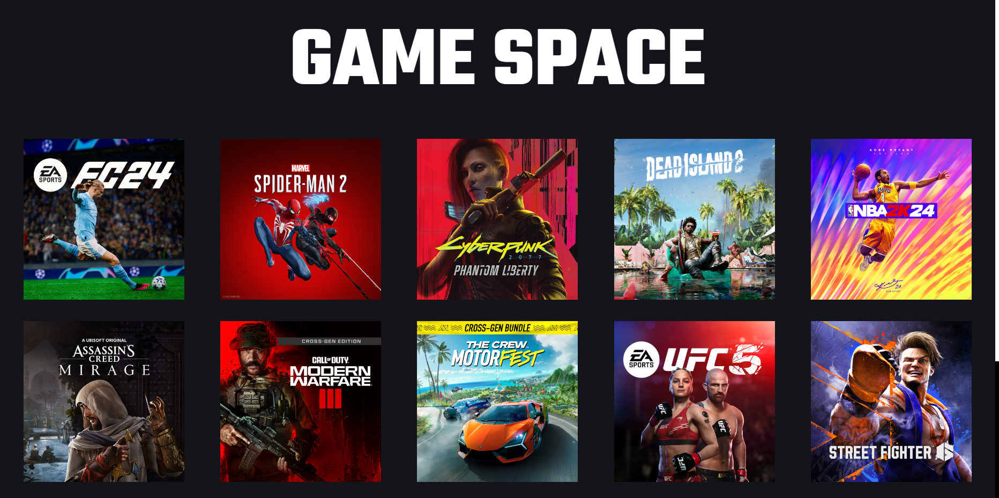

# Game Space

This is a mini-project called "Game Space" that simulates an online game store. The application is developed using React and CSS Modules, and utilizes View Transitions API for smooth transitions, enhancing the user experience during navigation.




## Features
1. List of available games.
2. Detailed page for each game.
3. Smooth transitions and animations when switching pages.

## Installation

1. Clone this repository on your local machine.

2. Install the necessary dependencies: cd game-store - ```npm install```

3. Start the development server:  ```npm start```

4. Open your web browser and visit ```http://localhost:3000``` to access the game store.

## License
Licensed Under ***General Public License 3.0***

## Contributions
Contributions are welcome! If you find any errors or have ideas to improve the store, feel free to open an issue or submit a pull request.